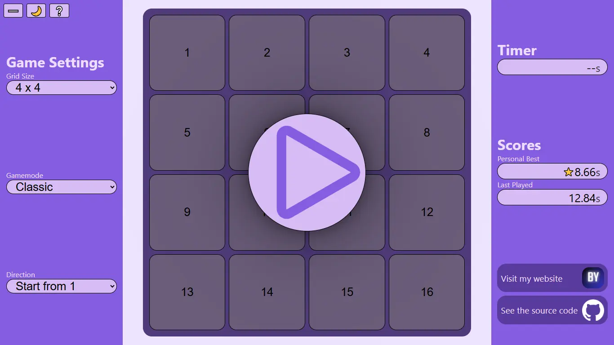

# schulteproject
A Schulte Table App written with [React](https://react.dev/) and [TypeScript](https://www.typescriptlang.org/), bootstrapped with [Create React App](https://github.com/facebook/create-react-app).  
  
[](https://skillicons.dev)  
  
## Try it on [my website](https://berkyeni.com/schulteproject/)
Features multiple game modes, score tracking, responsive design and light/dark themes. Play on anything!  
  
[](https://berkyeni.com/schulteproject/)
  
## Run locally
You need [Node](https://docs.npmjs.com/downloading-and-installing-node-js-and-npm) to run this project locally.  

1. Clone the repository  
   ```bash
   git clone https://github.com/BerkYeni/schultetable.git schulteproject
   ```
2. Go into schulteproject directory
   ```bask
   cd schulteproject
   ```
3. Install dependencies
   ```bash
   npm install
   ```
4. Start the development server
   ```bask
   npm run start
   ```


## What is a Schulte Table?
Schulte table is a cognitive exercise invented by German psychotherapist Walter Schulte.  
It is often used as a speed reading exercise, however it can also be played for fun!
